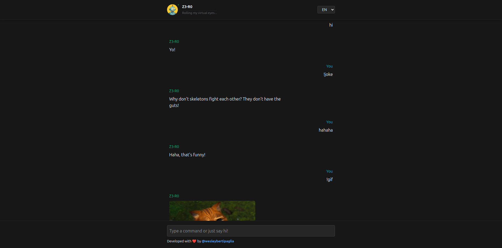

# 🤖 Z3-R0

This repository contains my submission for the [Alibaba Cloud Game Challenge](https://dev.to/devteam/join-us-for-the-alibaba-cloud-web-game-challenge-3000-in-prizes-1n5d?bb=220943), where participants were asked to build a creative game or interactive experience with a **robot-themed concept**.

**Z3-R0** is a sassy AI chatbot that plays games, cracks jokes, speaks out loud, and even entertains you when you're inactive. Built for fun and engagement, Z3-R0 is powered by web tech, AI vibes, and a dash of personality.

## 📌 Table of Contents

- [Features](#features)
- [Demo](#demo)
- [Get Started](#get-started)
- [Usage](#usage)
- [Contributing](#contributing)
- [License](#license)
- [Acknowledgements](#acknowledgements)

## 💡 Features

- 🎮 Interactive commands for gifs, memes, jokes, quotes, games, and music
- 🗣️ Voice messages using `SpeechSynthesisUtterance` API
- 🧠 Simulated conversational engine
- 💤 Inactivity detection with random responses (images, jokes, etc.)
- 🌍 Multi-language support: EN, ES, PT, CH, HI
- 💾 Local storage for user language + recent chat history (20 messages)
- 🛰️ Fun status bar messages like “Feeding the AI ego…”
- 🎭 Animations for online/offline transitions
- 🔊 Integrated sound effects
- 🐳 Docker support for static build and easy deployment

## 🚀 Demo

A preview of Z3-R0 in action:



> _More interactive demo coming soon..._

## ⚡ Get Started

### Prerequisites

- Node.js (v18+ recommended)
- Docker (optional, for containerized build)

### Clone the Repository

```bash
# Clone the repository
git clone https://github.com/wesleybertipaglia/z3-r0.git

# Navigate into the project folder
cd z3-r0
```

### Run Locally

```bash
# Install dependencies
npm install

# Start the development server
npm run dev
```

### Run in Docker

```bash
# Build the Docker image
docker compose up -d
```

## 🛠️ Usage

Once the bot is live, try typing:

- `!gif` to get a random gif
- `!meme` to fetch a meme
- `!joke` for a random joke
- `!quote` for a motivational quote
- `!game` to play a game
- `!music` to listen to some tunes
- `!help` for a list of commands

Z3-R0 keeps the chat engaging, even when you’re AFK 😎

## 🤝 Contributing

Contributions are welcome! If you have any suggestions or improvements, please open an issue or a pull request.

## 📄 License

This project is licensed under the MIT License. See the [LICENSE](LICENSE) file for more details.

## Acknowledgements

- [ChatGPT](https://openai.com/blog/chatgpt) for the robot's profile image.
- Sound Effect by <a href="https://pixabay.com/users/freesound_community-46691455/?utm_source=link-attribution&utm_medium=referral&utm_campaign=music&utm_content=91931">freesound_community</a> from <a href="https://pixabay.com//?utm_source=link-attribution&utm_medium=referral&utm_campaign=music&utm_content=91931">Pixabay</a>